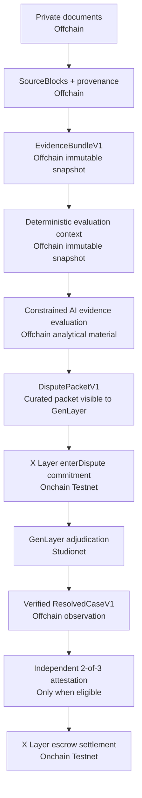

# Tolerance

Tolerance is an evidence-led commercial dispute workspace for conditional manufacturing settlement: it preserves private document provenance offchain, lets GenLayer adjudicate contested semantics, and relies on X Layer escrow for deterministic settlement.

> **Release candidate 2.** Tolerance is prepared for a controlled Testnet/demo evaluation. It is not a Mainnet deployment and automatic attestation remains disabled.

## Live application

- **Staging application:** [tolerance.vercel.app](https://tolerance.vercel.app)
- **Public read-only demo:** [tolerance.vercel.app/demo](https://tolerance.vercel.app/demo)
- **Source repository:** [github.com/ometere123/tolerance](https://github.com/ometere123/tolerance) (private during release-candidate validation)

The public web application uses X Layer Testnet and GenLayer Studionet only.

## Problem

Commercial release conditions often depend on documents: an amendment changes a tolerance, an inspection report records a measurement, and parties disagree about whether the evidence meets the governing terms. A conventional smart contract can enforce an already-authorized result, but is not a suitable authority for interpreting that evidence. An application AI can organize the material, but must not move money.

## Architecture



## Why both networks

- **GenLayer** independently adjudicates the semantic dispute over curated evidence and governing terms. The application’s AI evaluation is not a commercial authority.
- **X Layer** holds the commercial obligation and only executes a frozen, threshold-authorized resolution. It is the final settlement authority.
- **Tolerance** prepares evidence, enforces provenance and authorization, and coordinates the lifecycle. It cannot invent a final result or make an AI result move funds.

## Current Testnet deployments

| Network            | Identity                                     |
| ------------------ | -------------------------------------------- |
| X Layer Testnet    | chain `1952`                                 |
| Escrow             | `0xb0E937fd0AA0864167C85ccCBde282F847FC5eBd` |
| GenLayer Studionet | chain `61999`                                |
| Tolerance judge    | `0xFF1de4Ec0D3E26eC3BCa080Fd4587901dB48a56b` |

No Mainnet network is configured. The existing synthetic workflow remains safely `XLAYER_BINDING_PENDING` while official X Layer public RPC finality is unavailable; it must not be resent.

## Local setup

```bash
pnpm install --frozen-lockfile
cp .env.example .env.local
pnpm exec prisma generate
pnpm dev
```

See [`.env.example`](.env.example) for the environment contract. Server credentials must remain in `.env.local`; no `NEXT_PUBLIC_` variable may contain a secret.

### Database migrations

Apply additive migrations against the configured database with:

```bash
pnpm exec prisma migrate deploy
pnpm exec prisma migrate status
```

### Accounts and demo

Public users can create a Supabase Auth account at `/signup`, confirm email through the SSR callback, recover a password, and create an organization through first-login onboarding. A Tolerance login never creates or stores a blockchain private key. Optional X Layer wallet linking uses an expiring one-time signed challenge and persists only verified public ownership; it can also be completed later from `/app/account`.

Buyer organizations can issue hashed, expiring supplier invitations. Explicit acceptance grants the selected supplier organization deal-scoped access without publishing the dossier. The obligation workspace then prepares the frozen create, accept, exact token approval, fund, evidence commitment, challenge, timeout-refund, and uncontested-finalization calls for the appropriate verified party wallet.

### Demo dataset

The public `/demo` route uses a sanitized, read-only 316L dossier and performs no mutations. The controlled authenticated demo uses the repository's synthetic integration fixtures, which exercise the production evidence/context/packet builders without sending an X Layer or GenLayer transaction. Follow [docs/DEMO.md](docs/DEMO.md) for the exact route and fallback story; do not place test data in a production organization.

## Testing

```bash
pnpm verify
pnpm exec prisma validate
pnpm exec prisma migrate status
pnpm test:e2e
pnpm test:e2e:rc3-mail
# with .venv-genlayer active
python -m pytest genlayer/tests/direct -v
forge test
```

`test:e2e:rc3-mail` is an explicit staging release proof. It creates a disposable synthetic inbox and isolated synthetic dossier, then verifies the real Supabase/Brevo confirmation and recovery links against the configured public URL. It never uses customer data or sends a blockchain transaction.

Detailed commands and current test evidence are in [docs/testing/TEST_STRATEGY.md](docs/testing/TEST_STRATEGY.md). A guided presentation is in [docs/DEMO.md](docs/DEMO.md); trust and custody boundaries are in [docs/SECURITY.md](docs/SECURITY.md).

## Staging deployment

The public web application is deployed separately from the persistent GenLayer CLI signer. Vercel creates durable server-owned submission intents; a single non-public Railway worker is the only component that may use the encrypted submitter account. Its encrypted-keystore, Studionet, account-address, and database self-check has been verified. See [docs/DEPLOYMENT.md](docs/DEPLOYMENT.md) for environment names, migration procedure, health checks, rollback, and the keystore-volume boundary.

## Known limitations

- The GenLayer CLI/keychain submitter needs a persistent isolated runtime and is not suitable for an ephemeral serverless function.
- `FINALIZED_STATE_VERIFIED` is intentionally not enough to make an attestation round signable. Safe independent execution/target/method provenance is still required.
- Automatic attestation is permanently fail-closed in this release candidate: `AUTOMATIC_ATTESTATION_ENABLED=false`.
- Testnet RPC finality may be delayed or unavailable. The product shows reconciliation states and never blindly repeats an external transaction.
- The fast path's `proposeFastOutcome` call requires an EIP-712 authorization from the frozen on-chain adjudicator role. The ordinary Vercel application intentionally does not hold that signer; proposal generation remains unavailable until isolated adjudicator custody is provisioned. Challenge and uncontested finalization controls render from verified persisted state.

For architecture detail, start with the [architecture decisions](docs/architecture/ARCHITECTURE_DECISION_RECORD.md) and the [domain model](docs/architecture/DOMAIN_MODEL.md); the current tree is under `docs/architecture/`. Superseded phase build records are archived as chaptered files under `docs/history/`.
