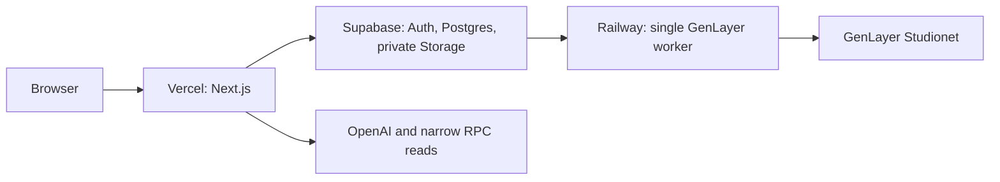

# Tolerance staging deployment

Tolerance Release Candidate 1 is a public web deployment connected only to X Layer Testnet and GenLayer Studionet. It is not a Mainnet deployment.

## Topology



Vercel authorizes users and creates only durable `GENLAYER_SUBMISSION_PENDING` intents. It never receives the GenLayer keystore or invokes the CLI submitter. The single Railway worker rechecks persisted lineage, uses the encrypted CLI account, and persists the transaction hash immediately after a send.

## Environment contract

Configure names only; do not copy values into source control.

| Scope          | Variables                                                                                                                                                                                                                                               |
| -------------- | ------------------------------------------------------------------------------------------------------------------------------------------------------------------------------------------------------------------------------------------------------- |
| Vercel public  | `NEXT_PUBLIC_SUPABASE_URL`, `NEXT_PUBLIC_SUPABASE_ANON_KEY`                                                                                                                                                                                             |
| Vercel server  | `DATABASE_URL`, `DIRECT_URL`, `SUPABASE_SERVICE_ROLE_KEY`, `OPENAI_API_KEY`, `TOLERANCE_APP_ORIGIN`, `TOLERANCE_ENVIRONMENT=production`, `XLAYER_RPC_URL`, `GENLAYER_RPC_URL`, `GENLAYER_SUBMISSION_MODE=worker`, `AUTOMATIC_ATTESTATION_ENABLED=false` |
| Railway worker | `DATABASE_URL`, `DIRECT_URL`, `GENLAYER_SUBMISSION_MODE=worker`, `AUTOMATIC_ATTESTATION_ENABLED=false`, `GENLAYER_WORKER_POLL_MS`, `GENLAYER_WORKER_SELF_CHECK_ONLY`, and the sealed keystore unlock secret                                             |

The worker must not receive OpenAI or Supabase Storage secrets. No `NEXT_PUBLIC_` variable may contain a secret. The canonical variable list is [`.env.example`](../.env.example).

## Database deployment

Apply existing additive migrations before switching staging traffic:

```bash
pnpm exec prisma migrate deploy
pnpm exec prisma migrate status
```

Never use a reset or destructive migration in staging. The readiness endpoint is `GET /api/health`; it reports only application/database availability.

## GenLayer worker and signer

The worker uses `Dockerfile.genlayer-worker` and runs `pnpm worker:genlayer`. It requires one persistent Railway volume only for the encrypted GenLayer CLI account/configuration. Customer evidence, Postgres data, and Supabase Storage never belong on that volume.

At startup it checks database connectivity, Studionet (`61999`), the configured judge, its active public account, and `AUTOMATIC_ATTESTATION_ENABLED=false`. The required public submitter is `0xb5ecd6dda36b370aca4af5e2005d8e2ae89c6db2`.

Transfer only a portable encrypted CLI keystore through a secure Railway volume workflow. At worker startup `scripts/genlayer-worker-entrypoint.sh` imports and unlocks it into the volume-scoped CLI home before the Node process starts. On Linux, the worker starts an isolated D-Bus/Secret Service session backed by the encrypted keyring; the decrypted key is never written to an application environment variable or plaintext file. The keystore password is an independent sealed Railway secret. Do not export or copy a raw private key, commit a keystore, or put signer material in Vercel.

The first worker deployment safely idles with `GENLAYER_WORKER_KEYSTORE_NOT_READY` if the encrypted file has not yet reached the mounted volume. It cannot claim or submit a job in that state. Upload the encrypted file, then redeploy to run the normal self-check. `GENLAYER_WORKER_SELF_CHECK_ONLY=true` is a provisioning mode: it verifies encrypted keystore import, authorized account, Studionet, configured judge, and database without claiming a submission. Turn it off only through a deliberate operations change after confirming the queue contains no unexpected eligible intent.

## Release-candidate deployment evidence

- Vercel production URL: `https://tolerance.vercel.app`
- Railway service: `tolerance-genlayer-worker` (no public domain)
- Vercel health check: application ready and database reachable
- Public authenticated Playwright suite: six tests passed using the real `/login` and Supabase Auth boundary
- Railway signer self-check: encrypted keystore import, public account `0xb5ecd6dda36b370aca4af5e2005d8e2ae89c6db2`, Studionet configuration, and database connectivity verified

The Railway source is deployed from the committed local repository while the GitHub repository remains private. Enable the Railway GitHub App for that private repository before relying on automatic GitHub-source deploys.

## Rollback

Rollback Vercel or Railway to the prior verified deployment. Do not replay pending external transactions: `GENLAYER_SUBMISSION_UNKNOWN`, `SETTLEMENT_UNKNOWN`, and `REVIEW_REQUIRED` require reconciliation. The worker may retry only a durable `FAILED_BEFORE_SEND` intent.

## Network limits

- X Layer Testnet: chain `1952`; no Mainnet configuration.
- GenLayer Studionet: chain `61999`; no Bradbury configuration.
- Automatic attestation remains disabled.
- The known synthetic X Layer workflow stays pending until its original transaction can meet the configured finality policy; it must not be resent.
